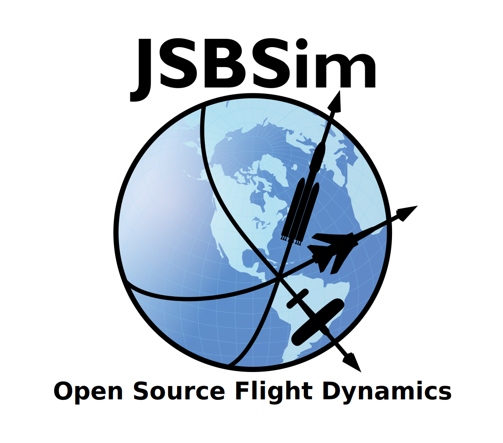

# JSBSim Reference Manual

{: .center width="65%" }

JSBSim is a lightweight, data-driven, non-linear, six-degree-of-freedom
(6DoF), batch simulation application aimed at modeling flight dynamics and control for aircraft.
Since the earliest versions, JSBSim has benefited from the open source development environment
it has grown within and from the wide variety of users that have contributed ideas for its continued
improvement.

This online reference manual is a community effort to keep the users and developers up-to-date
with all the functionalities of the software.

**Licensing:** JSBSim is licensed under the terms of the GNU Lesser GPL (LGPL).

## Useful Links

- [JSBSim Website](https://jsbsim.sourceforge.net/)
- [JSBSim Projects on GitHub](https://github.com/JSBSim-Team)
<!-- - [JSBSim Doxygen Reference]() -->
