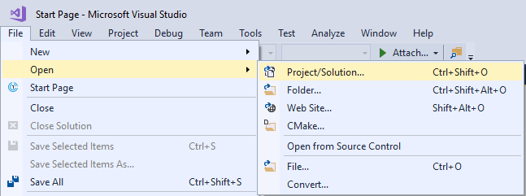
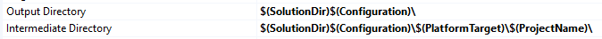
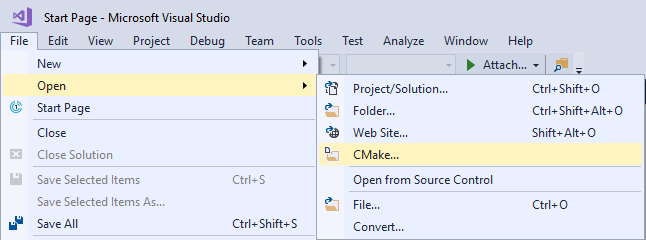
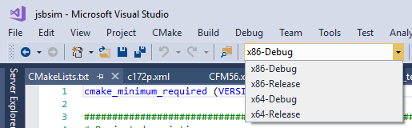
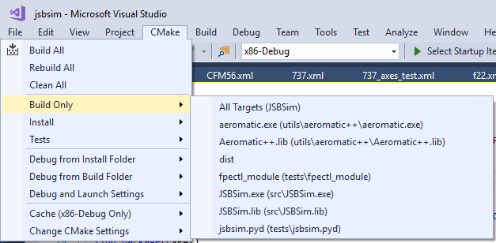
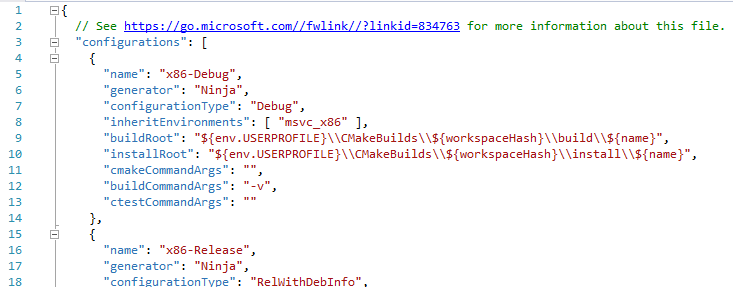
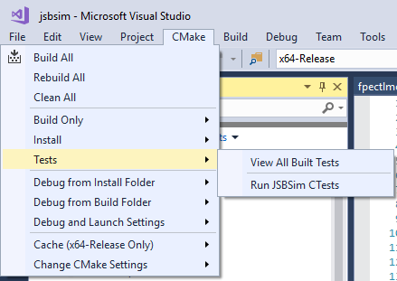
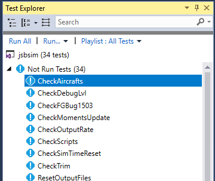

# Building using Visual Studio

With the advent of CMake support in Visual Studio 2017 there are now two ways to build JSBSim and the various components using Visual Studio 2017. There is a standard set of Visual Studio project files (`*.vcxproj`) for the various components like the main JSBSim program, Aeromatic++, etc. and a solution file (`*.sln`) that references the various project files. Alternatively you can use the new CMake support to build JSBSim and the various components using CMake via Visual Studio.

Check out the JSBSim source tree using git. For these examples the source code has been checked out to:

```console
C:\source\JSBSim
```

## Building using VS 2017 Project Files
Use the **File → Open → Project/Solution …** menu option.

{: .center width="80%" }

Browse to the location of the JSBSim source and select the JSBSim.sln in the root of the source code tree, in this example:

```console
C:\source\JSBSim\JSBSim.sln
```

The project files have been configured to store the compiler and linker’s intermediate files and the final output files in a directory outside of the source code tree of JSBSim, i.e. outside of `C:\source\JSBSim\src`.

{: .center width="85%" }

So for example the intermediate files for JSBSim and Aeromatic will be stored in the following directories:

```console
C:\source\JSBSim\Debug\x64\JSBSim
C:\source\JSBSim\Debug\x64\aeromatic
```

The output files will be found in:

```console
C:\source\JSBSim\Debug
```

## Building using VS 2017 CMake Support
Use the **File → Open → CMake …** menu option.

{: .center width="80%" }

Browse to the location of the JSBSim source and select the CMakeLists.txt in the root of the source code tree, in this example:

```console
C:\source\JSBSim\CMakeLists.txt
```

There are 4 build configurations in total, x86, x64 and Debug and Release versions for each. Select the build configuration you want to build.

{: .center width="80%" }

Then use the **CMake** menu option to decide which components you would like to build.

{: .center width="80%" }

By default Visual Studio configures CMake to build outside the source tree, defaulting to a build directory in the user’s home directory and using a GUID (Globally Unique ID) as part of the directory path. You will see the generated path displayed in the Output window of Visual Studio, for example:

```console
Working directory: C:\Users\Sean\CMakeBuilds\3f00c6d9-d323-5a32-8a90-665138817fd4\build\x64-Release
```

If for example you don’t want to use your home directory for your CMake builds then you can generate a *CMakeSettings.json* file by using the **CMake → Change CMake Settings** menu option and then editing the **buildRoot** and **installRoot** properties.

{: .center width="90%" }

Lastly Visual Studio also supports the execution of the JSBSim tests.

{: .center width="70%" }

{: .center width="50%" }

