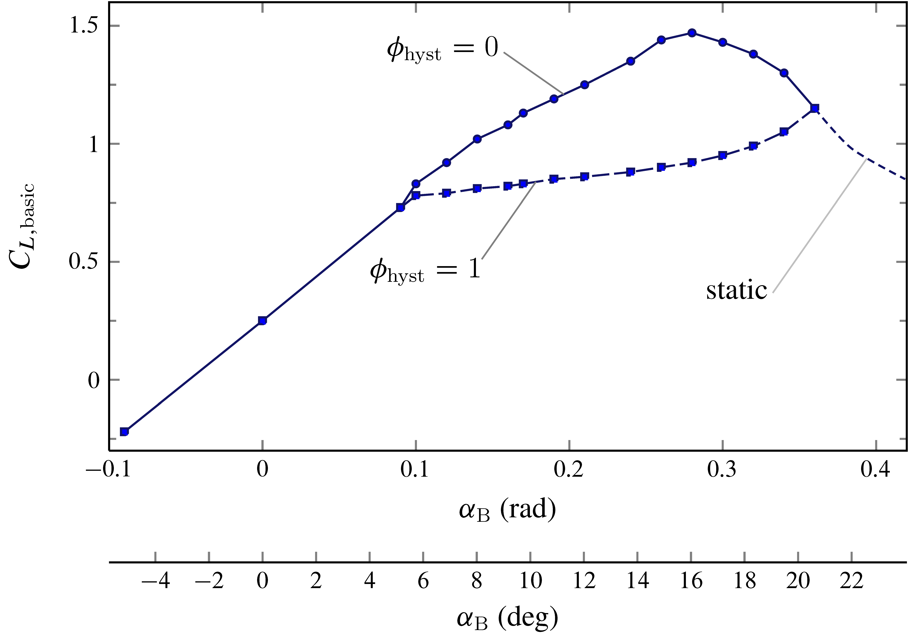
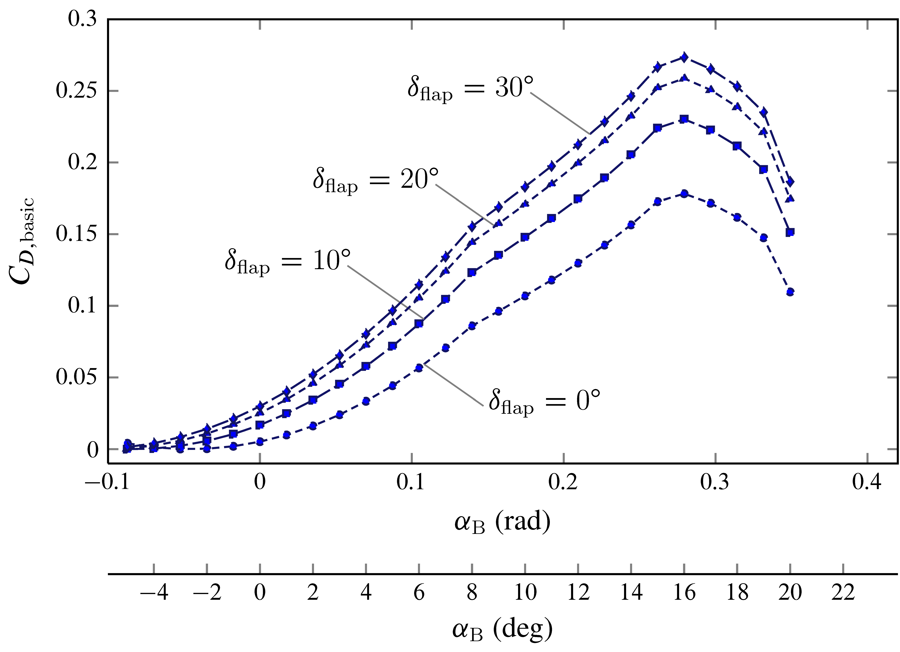

# Forces and Moments

## Aerodynamics

There are several ways to model the aerodynamic forces and moments (torques) that act on an aircraft. JSBSim started out by using the coefficient buildup method. In the coefficient buildup method, the lift force (for instance) is determined by summing all of the contributions to lift. The contributions differ depending on the aircraft and the fidelity of the model, but contributions to lift can include those from:

- Wing
- Elevator
- Flaps

Aerodynamic coefficients are numbers which, when multiplied by certain other values (such as dynamic pressure and wing area), result in a force or moment. The coefficients can be taken from flight test reports or textbooks, or they can be calculated using software (such as Digital DATCOM or other commercially available programs) or by hand calculations. Eventually, JSBSim added support for aerodynamic properties specified as functions. Within the `<aerodynamics>` section of a configuration file there are six subsections representing the 3 force and 3 moment axes (for a total of six degrees of freedom). The basic layout of the aerodynamics section is as follows:

```xml
<aerodynamics>
   <axis name="DRAG">
      { force contributions }
   </axis>
   <axis name="SIDE">
      { force contributions }
   </axis>
   <axis name="LIFT">
      { force contributions }
   </axis>
   <axis name="ROLL">
      { moment contributions }
   </axis>
   <axis name="PITCH">
      { moment contributions }
   </axis>
   <axis name="YAW">
      { moment contributions }
   </axis>
</aerodynamics>
```

Individual axes are not all absolutely required. There are several standard grouped sets of axes that are supported in JSBSim:

- `"DRAG"`, `"SIDE"`, `"LIFT"` (wind axes)
- `"X"`, `"Y"`, `"Z"` (body axes)
- `"AXIAL"`, `"SIDE"`, `"NORMAL"` (body axes)

All three systems accept `"ROLL"`, `"PITCH"`, `"YAW"` axis definitions. The axial systems cannot be mixed.
Within the axis elements, functions are used to define individual force or moment contributions to the total for that axis. Functions are used throughout JSBSim. In defining a force or moment, functions can employ the use of tables, constants, trigonometric functions, or other standard C
library functions. Simulation parameters are referenced via properties. Here is an example:

```xml
<function name="aero/force/lift_due_to_flap_deflection">
   <description>Lift contribution due to flap deflection</description>
   <product>
      <property>aero/function/ground-effect-factor-lift</property>
      <property>aero/qbar-area</property>
      <table>
         <independentVar>fcs/flap-pos-deg</independentVar>
         <tableData>
             0.0  0.0
            10.0  0.20
            20.0  0.30
            30.0  0.35
         </tableData>
      </table>
   </product>
</function>
```

In this case, a description in words of what the above does is as follows: the value of the function is the product of the `ground-effect-factor-lift`, `qbar-area`, and the value determined by the table, which is indexed as a function of flap position in degrees.

All of the functions in an `<axis/>` section are summed and applied to the aircraft in the appropriate manner. There is some flexibility in this format, though. Functions that are specified outside of any `<axis/>` section are created and calculated, but they do not specifically contribute to any force or moment total by themselves. However, they can be referenced by other functions that are in an `<axis/>` section. This technique allows calculations that might be applied to several individual functions to be performed once and used several times. The technique can be taken even further, with actual aerodynamic coefficients being calculated outside of an `<axis/>` definition, with the coefficients subsequently being multiplied within function definitions by the various factors (properties) that turn them into forces and moments inside an `<axis/>` definition.

As an example, let’s examine the instantaneous lift force $L(t)$. It is expressed with the following build-up formula:

$$
L = L_\mathrm{basic} \big(\alpha_\mathrm{B},\phi_\mathrm{hyst}\big) + \Delta L \big(\delta_\mathrm{flap}\big) + \Delta L \big(\delta_\mathrm{e}\big) + \Delta L \big(\dot{\alpha}_\mathrm{B}\big) + \Delta L \big( q \big)
\label{eq:Build:Up:Formula:Lift}
$$

where $\alpha_\mathrm{B}$, $\delta_\mathrm{flap}$, $\delta_\mathrm{e}$, $\dot{\alpha}_\mathrm{B}$ and $q$ are the well-known aircraft state variables. The non-dimensional scalar $\phi_\mathrm{hyst}$ is usually equal to 0 and becomes 1 at high angles of attack (near stall situations, when aerodynamic hysteresis effects are modeled).

The term $L_\mathrm{basic} \big(\alpha_\mathrm{B},\phi_\mathrm{hyst}\big)$ in ($\ref{eq:Build:Up:Formula:Lift}$) is called the “basic” contribution to the build-up and is dependent on the angle of attack. We know that increasing the angle of attack increases lift — up to a point. Lift force is traditionally defined as the product of filght dynamic pressure (“qbar”, $\bar{q}$, or $\bar{q}_\infty$ for aerodynamicists), wing area ($S_\mathrm{W}$ or simply $S$), and lift coefficient ($C_L$). In this case, the lift coefficient is determined via a lookup table, using $\alpha_\mathrm{B}$ and $\phi_\mathrm{hyst}$ as an index into the table:

```xml
<function name="aero/force/lift_from_alpha">
   <description> Lift due to alpha </description>
   <product>
      <property> aero/qbar-psf </property>
      <property> metrics/Sw-sqft </property>
      <property> aero/function/kCLge </property>
      <table>
         <independentVar lookup="row"> aero/alpha-rad </independentVar>
         <independentVar lookup="column"> aero/stall-hyst-norm </independentVar>
         <tableData>
                      0.0000   1.0000
            -0.0900  -0.2200  -0.2200
             0.0000   0.2500   0.2500
             0.0900   0.7300   0.7300
             0.1000   0.8300   0.7800
             0.1200   0.9200   0.7900
             0.1400   1.0200   0.8100
             0.1600   1.0800   0.8200
             0.1700   1.1300   0.8300
             0.1900   1.1900   0.8500
             0.2100   1.2500   0.8600
             0.2400   1.3500   0.8800
             0.2600   1.4400   0.9000
             0.2800   1.4700   0.9200
             0.3000   1.4300   0.9500
             0.3200   1.3800   0.9900
             0.3400   1.3000   1.0500
             0.3600   1.1500   1.1500
         </tableData>
      </table>
   </product>
</function>
```

The basic lift coefficient

$$
C_{L,\mathrm{basic}} = \frac{L_\mathrm{basic} \big(\alpha_\mathrm{B},\phi_\mathrm{hyst}\big) }{\bar{q} S}
\label{eq:Build:Up:Formula:Lift:Coefficient}
$$

is plotted below as a function of $\alpha_\mathrm{B}$ and $\phi_\mathrm{hyst}$.

<figure markdown>
  {: .center width="70%" }
  <p markdown="span">
	The plotted function of two variables $C_{L,\mathrm{basic}}\big(\alpha_\mathrm{B},\phi_\mathrm{hyst}\big)$ corresponding to the tabular function named 'aero/coefficient/CLwbh' in the aerodynamic model of c172p.
  </p>
</figure>

!!! note "TODO"

    Complete subsection.

---

<figure markdown>
  {: .center width="70%" }
  <p markdown="span">
	The plotted function of two variables $C_{D,\mathrm{basic}}\big(\alpha_\mathrm{B},\delta_\mathrm{flap}\big)$ corresponding to the tabular function named 'aero/coefficient/CDwbh' in the aerodynamic model of c172p.
  </p>
</figure>

!!! note "TODO"

    Complete the following subsections.

## Propulsion

## Weight

## Ground Contact
