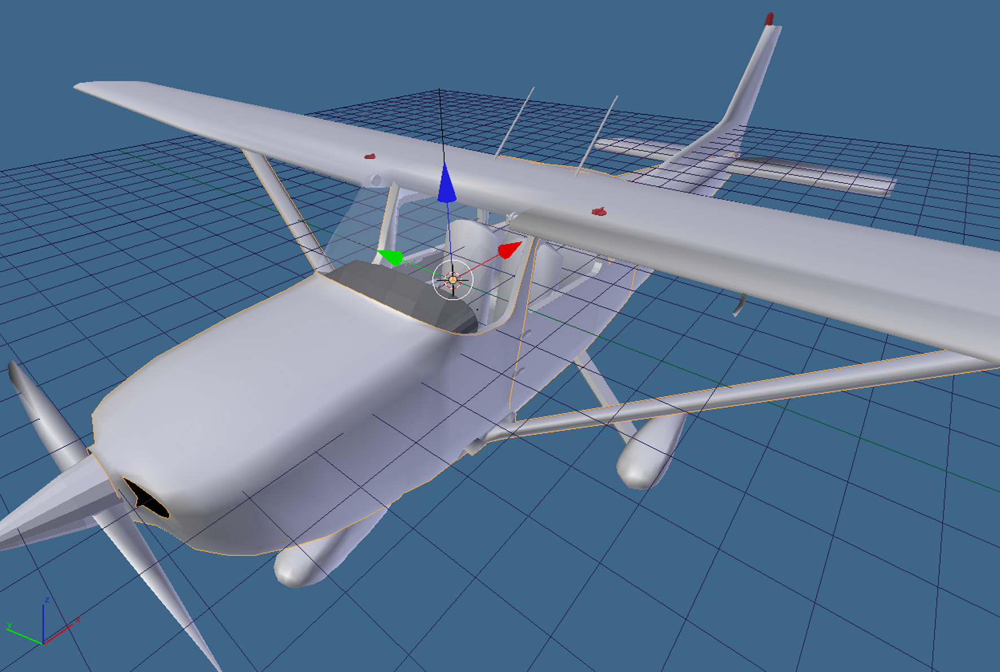
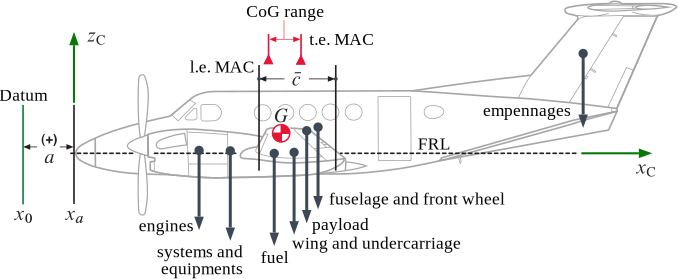
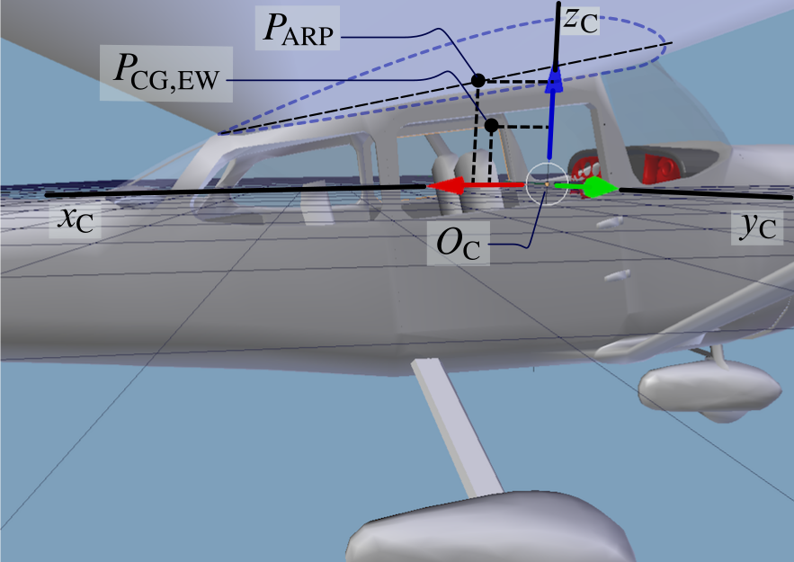
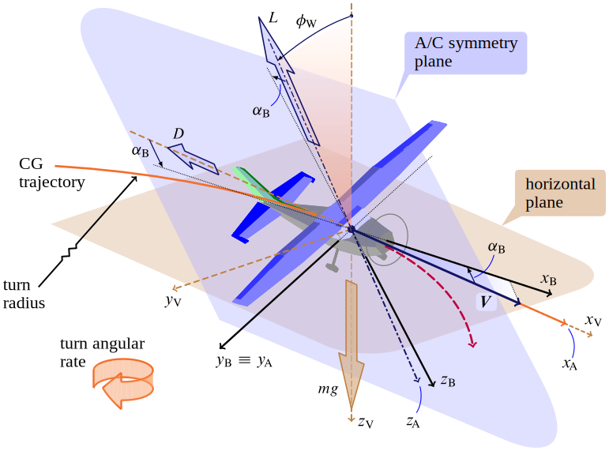
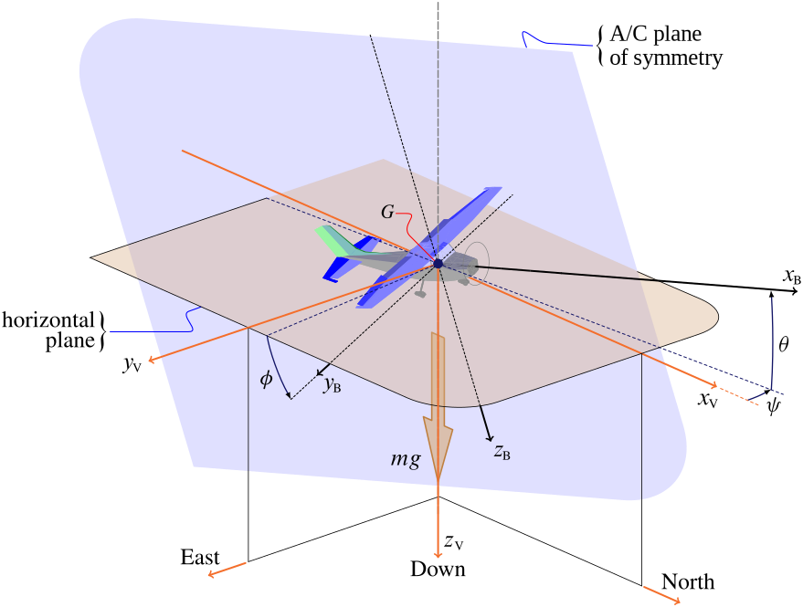

# Frames of Reference

Before moving into a description of the configuration file syntax, one must understand some basic information about some of the frames of reference used (*i*) in describing the location of objects on the aircraft, (*ii*) in specifying conditions related to the position and orientation of the aircraft in space, or (*iii*) when assigning inputs for a given flight condition.

Learn more on [Wikipedia about axes conventions](https://en.wikipedia.org/wiki/Axes_conventions).

## Structural, or "Construction" Frame

This frame is a common manufacturer's frame of reference and is used to define points on the aircraft such as the center of gravity, the locations of all the wheels, the pilot eye-point, point masses, thrusters, and so on. Items in the JSBSim aircraft configuration file are located using this frame.

In the structural frame the X-axis runs along the fuselage length and points towards the tail, the Y-axis points from the fuselage out towards the right wing, and of course the Z-axis then is positive upwards. Typically, the origin $O_\mathrm{C}$ for this frame is near the front of the aircraft (at the tip of the nose, at the firewall for a single engine airplane, or at some distance in front of the nose). This frame is often named \(\mathcal{F}_\mathrm{C} = \{O_\mathrm{C}, x_\mathrm{C}, y_\mathrm{C}, z_\mathrm{C}\}\).

<figure markdown>
  {: .center width="90%" }
  

    Aircraft structural (or construction) frame of reference with origin $O_\mathrm{C}$. Besides the structural frame axes $x_\mathrm{C}$, $y_\mathrm{C}$, and $z_\mathrm{C}$, the standard body frame axes $x_\mathrm{B}$, $y_\mathrm{B}$, and $z_\mathrm{B}$ are also shown with their origin at the center of mass $G$. The pilot's eye-point is located at $P_\mathrm{EP}$.
  

</figure>

The X-axis is typically coincident with the fuselage centerline and often is coincident with the thrust axis (for instance, in single engine propeller aircraft it passes through the propeller hub). Positions along the $x_\mathrm{C}$ axis are referred to as stations. Positions along the $z_\mathrm{C}$ axis are referred to as waterline positions. Positions along the $y_\mathrm{C}$ axis are referred to as buttline positions.

<figure markdown>
  {: .center width="70%" }
  

    A screenshot taken from the 3D modeling software Blender. The scene shows a model of Cessna 172 with its structural frame $\mathcal{F}_\mathrm{C} = \{O_\mathrm{C}, x_\mathrm{C}, y_\mathrm{C}, z_\mathrm{C}\}$. The origin $O_\mathrm{C}$ in this case is located inside the cockpit, near the dashboard.
  

</figure>

Note that the origin can be anywhere for a JSBSim-modeled aircraft, because JSBSim internally only uses the *relative distances* between the CG and the various objects --- not the absolute locations themselves.

<figure markdown>
  {: .center width="90%" }
  

    Center of gravity (CG) position, point $G$, determined in a construction frame.
  

</figure>

<figure markdown>
  {: .center width="90%" }
  

    Definition of ground contact points in terms of construction frame locations.
  

</figure>

<figure markdown>
  {: .center width="70%" }
  

    Two key point locations $P_\mathrm{ARP}$ and $P_\mathrm{CG,EW}$ in the structural frame, respectively, he pole of aerodynamic moments and the Empty Weight CG of the airframe. The shape of the wing root profile and its chord are also sketched.
  

</figure>

<figure markdown>
  {: .center width="70%" }
  

    Besides point $P_\mathrm{CG,EW}$, are represented two more significant locations, $P_\mathrm{Pilot}$ and $P_\mathrm{Right\,Pass}$, where two additional masses are concentrated, respectively, of the pilot and of the right passenger.
  

</figure>

## Body Frame

In JSBSim, the body frame is similar to the structural frame, but rotated 180 degrees about the $y_\mathrm{C}$, with the origin coincident with the CG. Typycally, the body frame is defined by knowning the position of the airplane's center of mass $G$ and the direction of the longitudinal construction axis $x_\mathrm{C}$. The axis $x_\mathrm{B}$ shall be chosen such that it originates from $G$, it is parallel to $x_\mathrm{C}$, and with a positive verse from $G$ towards the fuselage nose.

The frame of body axes is often called $\mathcal{F}_\mathrm{B} = \{G, x_\mathrm{B}, y_\mathrm{B}, z_\mathrm{B}\}$. The $x_\mathrm{B}$ axis is called the *roll axis* and points forward, the $y_\mathrm{B}$ axis is called *pitch axis* and points toward the right wing, the $z_\mathrm{B}$ axis is called *yaw axis* and points towards the fuselage belly.

<figure markdown>
  {: .center width="90%" }
  

    Standard aircraft body axis frame, with origin at the center of gravity $G$.
  

</figure>

In the body frame the aircraft forces and moments are summed and the resulting accelerations are integrated to get velocities.

## Stability, or "Aerodynamic" Frame

This frame is defined according to the instantaneous orientation of the relative wind vector with respect to the airframe. If, for simplicity, the air is still with respect to the Earth (no wind), and $\boldsymbol{V}$ is the aircraft center-of-mass velocity vector with respect to the Earth-fixed observer (also named $\boldsymbol{V}_\mathrm{CM/E}$ to emphasize the relative motion), then $-\boldsymbol{V}$ is the relative wind velocity and $V = \|\boldsymbol{V}\|$ is the airspeed.

The frame, named $\mathcal{F}_\mathrm{A} = \{ G, x_\mathrm{A}, y_\mathrm{A}, z_\mathrm{A} \}$, has the axis $x_\mathrm{A}$ that points into the relative wind vector projected onto the aircraft plane of symmetry $x_\mathrm{B} z_\mathrm{B}$. The axis $y_\mathrm{A}$ still points out the right wing and coincides with the body axis $y_\mathrm{B}$, and the axis $z_\mathrm{A}$ completes the right-hand system.

<figure markdown>
  {: .center width="90%" }
  

    Aerodynamic frame, defining the aerodynamic angles $\alpha_\mathrm{B}$ and $\beta$.
  

</figure>

The two axes $x_\mathrm{A}$ and $z_\mathrm{A}$ belong, by definition, to the aircraft symmetry plane, but *they can rotate during flight* because the orientation of the relative wind velocity vector $\boldsymbol{V}$ might change with respect to the vehicle. The above figure shows how the aerodynamic frame is constructed. The angle between the two axes $x_\mathrm{A}$ and $x_\mathrm{B}$ is the aircraft angle of attack $\alpha_\mathrm{B}$. The angle formed by the instantaneous direction of $\boldsymbol{V}$ and its projection on the plane $x_\mathrm{B} z_\mathrm{B}$ is the sideslip angle $\beta$.

This frame, called stability frame in some manuals, is also named here 'aerodynamic frame' because the projection $Z_\mathrm{A}$ of the instantaneous aerodynamic resultant force $\mathcal{F}_\mathrm{A}$ onto the axis $z_\mathrm{A}$ defines the aerodynamic lift. In particular, the lift $L$ is such that $-L$ is the component of $\mathcal{F}_\mathrm{A}$ along $z_\mathrm{A}$, i.e. $Z_\mathrm{A}=-L$.

To visualize the above observation, consider a typical maneuver studied in flight mechanics: the zero-sideslip (or 'coordinated'), constant altitude turn at steady airspeed. In this situation the wings are banked and so is the lift. In such a turn $\mathcal{F}_\mathrm{A}$ is banked and $x_\mathrm{A}$ is kept horizontal. In general terms, the lift as a vector is always defined in the aircraft symmetry plane.

<figure markdown>
  {: .center width="90%" }
  

	Banked lift in a steady coordinated turn at constant altitude. The bank angle $\phi_\mathrm{W}$ is a rotation around the relative wind velocity vector. The motion is freezed in time when the velocity vector is aligned with the North. Coordinated turn means that $\beta=0$ and constant altitude means that $x_\mathrm{A}$ is kept horizontal.
  

</figure>

*Remark* --- In dynamic stability studies what is referred to as 'stability frame' is something slightly different from the aerodynamic frame introduced above: The stability frame in aircraft flight dynamics and stability conventions is nothing but a particular kind of body-fixed frame, defined with respect to an initial symmetrical, steady, wings-level, constant altitude flight condition. This conditions gives the direction of $x_\mathrm{S}$ (which coincides with $x_\mathrm{A}$ at that particular flight attitude). Therefore, in dynamic stability studies the stability frame, unlike the aerodynamic frame, is fixed with the vehicle.

In JSBSim the notion of stability frame $\mathcal{F}_\mathrm{S} = \{ G, x_\mathrm{S}, y_\mathrm{S}, z_\mathrm{S} \}$ is used to mean the aerodynamic frame.

## Earth-Centered Inertial Frame (ECI) and Earth-Centered Earth-Fixed Frame (ECEF)

The Earth-Centered Inertial frame (or simply 'inertial frame') $\mathcal{F}_\mathrm{ECI} = \{ O_\mathrm{ECI}, x_\mathrm{ECI}, y_\mathrm{ECI}, z_\mathrm{ECI} \}$ is fixed with its origin at the center of the Earth. Its cartesian axes remain fixed relative to the stars, and provide a reference frame for which the aircraft (or spacecraft) equations of motion are most simply expressed. The positive $z_\mathrm{ECI}$ axis passes through the Earth's geographic North Pole. The $x_\mathrm{ECI}$ and $y_\mathrm{ECI}$ axes lie in the equatorial plane. The axis $x_\mathrm{ECI}$ is always parallel to a line from the Sun's center of mass to Earth's position in orbit at the vernal equinox. The ECI system is shown in the next figure.

<figure markdown>
  {: .center width="60%" }
  

	Earth-Centered Inertial (ECI) frame and Earth-Centered Earth-Fixed (ECEF) frame.
  

</figure>

The axes of the Earth-Centered, Earth-Fixed (ECEF) frame of reference, labeled $x_\mathrm{ECEF}$, $y_\mathrm{ECEF}$, and $z_\mathrm{ECEF}$, are also depicted in the above figure. The ECEF coordinate axes remain fixed with respect to the Earth. The origin $O_\mathrm{ECEF}$ of this cartesian system, like the inertial frame, is located at the mass center of the earth. The $z_\mathrm{ECEF}$ axis also lies along the Earth's spin axis and coincides with $z_\mathrm{ECI}$. The $x_\mathrm{ECEF}$ and $y_\mathrm{ECEF}$ axes both lie in the equatorial plane, with the positive $x_\mathrm{ECEF}$ axis passing through the prime meridian (Greenwich Meridian). The ECEF frame rotates counter-clockwise about the Inertial frames $z_\mathrm{ECI}$ axis with angular velocity $\omega_\mathrm{E}$. The Earth angular rate $\omega_\mathrm{E}$ is approximately equal to $2\pi/24$ radians/hour.

## North-Oriented Tangent Frames

A *tangent-plane* coordinate system can be defined when a matemathical representation of Earth's surface is assumed (a *spheroid* or an approximating sphere). A plane tangent to a point of interest on the surface $O_\mathrm{E}$ is taken as a reference. A geographic system called *North-Oriented Tangent Frame* $\mathcal{F}_\mathrm{E} = \{ O_\mathrm{E}, x_\mathrm{E}, y_\mathrm{E}, z_\mathrm{E}\}$ has its origin fixed at the point of interest $O_\mathrm{E}$ and its plane $x_\mathrm{E} y_\mathrm{E}$ coincident with the tangent plane. The axis $x_\mathrm{E}$ points towards the geographic North, the axis $y_\mathrm{E}$ points towards the East. Finally, the axis $z_\mathrm{E}$ points downwards towards, parallel to the spheroid normal (It points to the center of the Earth if an approximating sphere is used instead of a spheroid). For this reason the frame $\mathcal{F}_\mathrm{E}$ is also called *tangent NED* frame (North-East-Down).

<figure markdown>
  {: .center width="60%" }
  

	Earth-Centered Earth-Fixed (ECEF) frame, geografic coordinates, Tangent (T) frame, and local Vertical (V) frame.
  

</figure>

## Local-Vertical Local-Level Frame, or Local NED Frame

The local vertical frame $\mathcal{F}_\mathrm{V} = \{ G, x_\mathrm{V}, y_\mathrm{V}, z_\mathrm{V}\}$ is unrelated to the airplane's orientation in space but is only defined by its CG position with respect to some convenient Earth-fixed observer. If $G_\mathrm{GT}$ is the CG projected on the ground ('ground tracked'), the coordinate plane $x_\mathrm{V} y_\mathrm{V}$ is parallel to a plane locally tangent in $G_\mathrm{GT}$ to the Earth's surface --- i.e. the plane $x_\mathrm{E} y_\mathrm{E}$ with $O_\mathrm{E} \equiv G_\mathrm{GT}$. Then, the axis $x_\mathrm{V}$ points towards the geographic North, the axis $y_\mathrm{V}$ points towards the East. Finally, the axis $z_\mathrm{V}$ points downwards towards the center of the Earth. For this reason the frame $\mathcal{F}_\mathrm{V}$ is also called *local NED* (vehicle-carried) frame.

<figure markdown>
  {: .center width="90%" }
  

	Aircraft body frame and local vertical frame (NED frame). The aircraft Euler angles are also shown: the heading angle $\psi$ (negative in the picture), the elevation angle $\theta$, and the roll angle $\phi$.
  

</figure>

The NED convention ensures that the aircraft weight is a force with components $(0,0,mg)$ in the frame $\mathcal{F}_\mathrm{V}$, where $m$ is the airplane's mass and $g$ is the gravitational acceleration.

The above figure shows an aircraft with the two frames $\mathcal{F}_\mathrm{V}$ and $\mathcal{F}_\mathrm{B}$. The Euler angles that define the body frame orientation with respect to the local NED frame are the *aircraft Euler angles*. For atmospheric flight vehicles the sequence of rotations used to define the Euler angles is '3-2-1'. This defines the *heading* angle $\psi$, the *elevation* angle $\theta$, and the *roll* angle $\phi$ with respect to an observer fixed with the Earth.

<figure markdown>
  {: .center width="60%" }
  

	Euler angle sequence for an aircraft. The frame $\mathcal{F}_\mathrm{E} = \{ O_\mathrm{E}, x_\mathrm{E}, y_\mathrm{E}, z_\mathrm{E}\}$ is an Earth-fixed NED coordinate system, with origin the $O_\mathrm{E}$ somewhere on the ground (or at see level) and the plane $x_\mathrm{E} y_\mathrm{E}$ tangent to the Earth surface. If the ground track point $G_\mathrm{GT}$ is not too far from $O_\mathrm{E}$, the Earth frame $\mathcal{F}_\mathrm{E}$ axes are parallel to those of the local NED frame $\mathcal{F}_\mathrm{V} = \{ G, x_\mathrm{V}, y_\mathrm{V}, z_\mathrm{V}\}$.
  

</figure>

## Wind Frame

Besides the lift, the instantaneous aerodynamic resultant force vector $\mathcal{F}_\mathrm{A}$ has two more components in a frame of reference of which $z_\mathrm{A}$ is the third axis. This frame is called *wind frame* $\mathcal{F}_\mathrm{W} = \{ G, x_\mathrm{W}, y_\mathrm{W}, z_\mathrm{W}\}$.

The wind frame is defined by taking the $x_\mathrm{W}$ axis along the relative wind with a positive verse in the direction of motion. This means that $x_\mathrm{W}$ is superimposed to the vector $\boldsymbol{V}$. The third axis of $\mathcal{F}_\mathrm{W}$ is taken along the lift line of action, i.e. $z_\mathrm{W} \equiv z_\mathrm{A}$. Finally, the second axis $y_\mathrm{W}$ is chosen in order to complete the right-handed triad. The wind frame has its third axis constantly in the airframe plane of symmetry (also called the 'reference plane'). All the three wind axes rotate with respect to the body axes because of the changing attitude of the aircraft with respect to the relative wind $-\boldsymbol{V}$.

The component $X_\mathrm{W}$ of the force vector $\mathcal{F}_\mathrm{A}$ along the direction of $\boldsymbol{V}$ defines the aerodynamic drag: The drag $D$ is such that $X_\mathrm{W}=-D$. In presence of a nonzero sideslip angle $\beta$, a third nonzero component of $\mathcal{F}_\mathrm{A}$ arises along the lateral axis $y_\mathrm{W}$, i.e. the side force component $Y_\mathrm{W}$.

When the sideslip angle $\beta$ is zero, the wind frame and the aerodynamic frame are coincident. Only in this circumstance $y_\mathrm{W}$, being coincident with $y_\mathrm{A}$ and $y_\mathrm{B}$, is normal to the reference plane $x_\mathrm{B} z_\mathrm{B}$.

The figure below shows the standard frames of reference for an aircraft in climbing flight in calm air. The wind frame $\mathcal{F}_\mathrm{W}$ can be made superimposed to the aerodynamic frame $\mathcal{F}_\mathrm{A}$ when rotated around $z_\mathrm{W}$ of the angle $-\beta$.

<figure markdown>
  {: .center width="90%" }
  

	Standard frames of reference and aircraft in climbing flight in calm air. The CG velocity vector $\boldsymbol{V}$ forms the flight path angle $\gamma$ with the horizontal plane. The standard three aerodynamic resultant force components $D$, $L$ and $Y_\mathrm{A}$ are also shown.
  

</figure>

Consequently, the wind frame $\mathcal{F}_\mathrm{W}$ can be superimposed to the body frame $\mathcal{F}_\mathrm{B}$ when rotated first around $z_\mathrm{W}$ of the angle $-\beta$ then around the axis $y_\mathrm{A}$ of the angle $\alpha_\mathrm{B}$:

$$
\mathcal{F}_\mathrm{W} \stackrel{-\beta \, \curvearrowright \, z_\mathrm{W}}{ \longrightarrow } \mathcal{F}_\mathrm{A} \stackrel{\alpha_\mathrm{B} \, \curvearrowright \, y_\mathrm{A}}{ \longrightarrow } \mathcal{F}_\mathrm{B}
\label{eq:FW:To:FB}
$$

The components of the aerodynamic resultant force in body axes are then expressed as follows:

$$
\left\{\begin{matrix}
  X_\mathrm{B} \\ Y_\mathrm{B} \\ Z_\mathrm{B}
\end{matrix}\right\} =
\left[\begin{matrix}
  \cos\alpha_\mathrm{B} & 0 & -\sin\alpha_\mathrm{B} \\
  0 & 1 & 0 \\
  \sin\alpha_\mathrm{B} & 0 & \cos\alpha_\mathrm{B}
\end{matrix}\right]
  \left[\begin{matrix}
    \cos\beta & \sin(-\beta) & 0 \\
    -\sin(-\beta) & \cos\beta & 0 \\
    0 & 0 & 1
  \end{matrix}\right]
  \left\{\begin{matrix}
    -D \\ Y_\mathrm{W} \\ -L
  \end{matrix}\right\}
\label{eq:DYL:To:XYZB}  
$$

in terms of drag, side force and lift.
